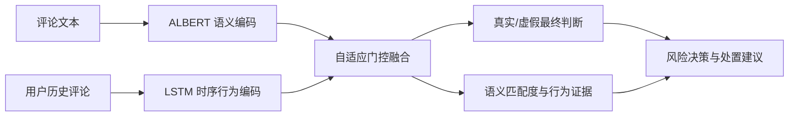

# 基于语义-时序门控融合的虚假评论智能检测系统

> 软件版本：V1.0.0（开发中）  
> 软件形态：Web 管理平台  
> 当前阶段：模型基线已冻结，应用层尚未实现

## 1. 项目定位

本项目拟将已经训练完成的 ALBERT + LSTM + 自适应门控融合模型封装为可部署的虚假评论检测系统。系统面向评论审核与风险分析场景，提供单条检测、批量检测、检测记录、模型评估、证据展示和报告导出功能。

V1.0 采用浏览器/服务器（B/S）架构。模型在 Linux GPU 服务器本地运行，用户通过浏览器访问系统，不依赖 OpenAI 等第三方在线 AI API。

## 2. 当前实现状态

README 只描述当前真实状态，避免软件说明、界面和实际代码不一致。

| 模块 | 状态 | 说明 |
| --- | --- | --- |
| LSTM 融合模型冻结基线 | 已完成 | 保存在 `../lstm_variant/`，不得由应用开发直接修改 |
| `spam_cascade` 模型核心副本 | 已完成 | 保存在 `model_core/spam_cascade/` |
| 模型基础配置 | 已完成 | `configs/base.json` |
| FastAPI 后端 | 待实现 | 当前目录只有骨架 |
| Vue 3 前端 | 待实现 | 当前目录只有骨架 |
| MySQL 数据库及迁移 | 待实现 | 尚未创建表结构 |
| 模型权重清单 | 待完善 | `model_manifest.json` 当前尚未填写 |
| Docker Compose 部署 | 待实现 | 在应用功能验收后完成 |
| 软著操作说明书 | 待编写 | 只记录已经验收的功能 |

## 3. 模型处理流程



所有评论均进入语义与行为融合流程。用户历史不足时，行为可用性掩码为 0，融合层自动转为语义主导，不将“缺少历史”解释为“行为正常”。

## 4. 输出及解释边界

系统计划输出以下信息：

- 最终真实性：`real` / `fake` 及对应概率；
- 四维语义相对匹配度：`real`、`misleading`、`exaggerated`、`advertising`；
- 行为辅助二分类：`normal` / `abnormal`；
- 五维行为相对匹配度：`normal`、`review_manipulation`、`crowdturfing`、`bot_like`、`insufficient_evidence`；
- `risk_source`、行为证据状态、融合门控摘要及处置建议。

必须遵守以下解释限制：

1. 门控权重是融合权重摘要，不是严格的因果归因。
2. 匹配度是相对证据分数；未经过独立标签监督和校准时，不能当作确定类别。
3. 当前行为二分类真值复用了原始评论真假标签，因此它属于时序行为分支的真实性代理任务，不是独立人工标注的异常行为真值。
4. 缺少行为历史时必须返回 `insufficient_evidence`，不得展示可靠的行为细类结论。
5. `risk_source` 是规则派生结果，不是独立的人工真值标签。

完整政策后续维护在 `docs/explainability_policy.md`，并同步落实到 API、结果页面和导出报告。

## 5. 计划技术栈

| 层次 | 技术 |
| --- | --- |
| 模型与推理 | Python、PyTorch、Transformers、ALBERT、LSTM |
| 后端 | FastAPI、Pydantic、SQLAlchemy、Alembic |
| 前端 | Vue 3、TypeScript、Element Plus、ECharts |
| 数据库 | MySQL 8.0，字符集 `utf8mb4` |
| 部署 | Linux、Nginx、Docker、Docker Compose |
| 测试 | Pytest、接口测试、前端组件测试 |

## 6. 目录结构

```text
software_v1/
├── model_core/            # 冻结模型核心与原模型测试
├── backend/               # FastAPI、MySQL ORM、服务及测试
├── frontend/              # Vue 3 + TypeScript 页面
├── configs/               # 应用配置和模型清单
├── models/                # 权重放置说明，不提交实际权重
├── deploy/                # Docker、Nginx和环境变量模板
├── runtime/               # 上传文件、报告和日志，不提交Git
├── docs/                  # 架构、API、解释政策和软著说明书
├── scripts/               # 启动、初始化和权重校验脚本
└── THIRD_PARTY_NOTICES.md # 第三方依赖及许可证声明
```

`../lstm_variant/` 是本软件使用的冻结科研基线。应用层只能通过后续的 `backend/app/ml/adapter.py` 调用模型核心，不得直接改写已验证的模型结构、分类头和标签顺序。

## 7. 数据要求

模型训练与评估数据至少包含：

```text
user_id, prod_id, rating, label, date, text
```

`review_id` 可以缺省，由加载器生成。用于实际无标签推理时不要求提供 `label`，但后端适配层需要将训练数据结构与推理请求结构明确分离。

可选监督字段：

```text
semantic_type, behavior_type
```

若缺少细分类标签，相应分数只能作为未经校准的相对匹配度展示。

## 8. 计划 REST API

```text
POST /api/v1/auth/login
GET  /api/v1/health
GET  /api/v1/model/info
POST /api/v1/detections/single
POST /api/v1/detections/batch
GET  /api/v1/tasks/{id}
GET  /api/v1/results
GET  /api/v1/results/{id}
POST /api/v1/evaluations
GET  /api/v1/reports/{id}
```

这些是系统自有 REST API。正式推理使用服务器本地模型权重，不在每次请求时连接 Hugging Face。

## 9. 模型权重与复现

模型权重、数据集、Hugging Face 缓存、数据库密码和运行日志不得提交到普通 Git 仓库。部署前必须在 `configs/model_manifest.json` 中记录：

- 模型和软件版本；
- 检查点名称及 SHA-256；
- 模型配置和标签顺序；
- Tokenizer 标识；
- 训练、验证数据哈希；
- 验证指标快照；
- Python、PyTorch、Transformers 和 CUDA 版本；
- Git 提交编号；
- 细分类是否经过监督和校准。

实际权重下载位置、文件名和哈希统一记录在 `models/README.md`。

## 10. 七个计划页面

1. 系统概览；
2. 单条评论检测；
3. 批量检测任务；
4. 检测记录；
5. 检测结果与证据详情；
6. 模型评估及语义/行为/融合对比；
7. 模型版本与系统配置。

登录页不计入七个主页面。V1.0 不提供网页在线训练，训练继续由冻结基线中的训练入口完成。

## 11. 开发顺序

1. 冻结基线并建立模型、配置和预测结果哈希快照；
2. 固定 Pydantic、TypeScript 和 Explanation JSON 契约；
3. 实现模型加载、适配器和单条/批量推理服务；
4. 实现 MySQL、Alembic 和 FastAPI 接口；
5. 实现七个前端主页面；
6. 完成解释边界、报告、测试和性能验收；
7. 完成 Docker 部署及软著操作说明书。

每个阶段单独提交并推送到远程分支。软著文档只描述已经实现、截图并通过验收的功能。

## 12. 第三方依赖说明

本系统使用 PyTorch、Transformers、FastAPI、Vue 等第三方框架。调用第三方框架不影响自主软件开发，但不得将第三方库内部源码、预训练权重或第三方组件声称为本项目原创成果。依赖名称、版本、用途和许可证统一记录在 `THIRD_PARTY_NOTICES.md`。

## 13. 安全与隐私

- 数据库密码、密钥和令牌只能通过环境变量注入；
- 用户标识应匿名化，避免存储不必要的个人信息；
- 上传文件必须限制类型、体积和保存路径；
- 模型路径必须来自受控配置，禁止通过请求加载任意服务器文件；
- 检测结果属于辅助审核建议，不代替人工事实认定。

