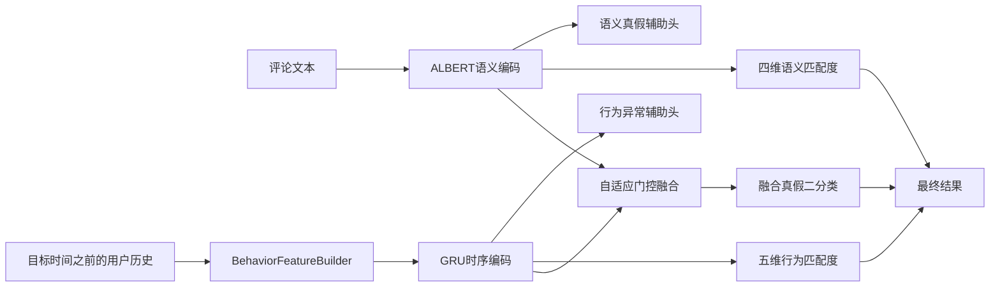

# 基于ALBERT-GRU门控融合的虚假评论检测系统 V1.0

本项目是浏览器/服务器架构的评论审核系统。正式模型固定为ALBERT语义流、GRU行为时序流和自适应向量门控融合层。最终真假只由融合真实性头决定；四维语义匹配度、行为异常二分类和五维行为匹配度只提供辅助证据。

## 已实现能力

- FastAPI、Pydantic、JWT、SQLAlchemy和Alembic后端；
- Vue 3和TypeScript前端；
- MySQL评论、任务、结果、模型、评估、报告及审计数据模型；
- 单条同步检测和数据库队列式批量检测；
- FastAPI进程及GPU Worker各自启动时加载一次完整融合模型；
- 模型manifest、检查点SHA-256、配置SHA-256和固定标签顺序校验；
- 真实测试集Recall、F1、PR-AUC、ROC-AUC和混淆矩阵评估；
- Explanation JSON v2和解释边界声明；
- Docker Compose部署模板。

权重和已填充manifest不在仓库中。当前[模型清单](configs/model_manifest.json)保留`pending_deployment_values`，填写真实版本、路径、哈希和环境记录后才能正式启动模型服务。

## 关键数据流



客户端只能提交原始历史事件，不能提交加工后的十维行为向量。训练、验证和线上推理共同使用`model_core/spam_cascade/data.py`中的`BehaviorFeatureBuilder`。历史查询严格限定在目标评论时间之前。

## 本地开发

后端环境必须安装项目依赖并设置`DATABASE_URL`、JWT和模型环境变量：

```bash
cd backend
alembic upgrade head
uvicorn app.main:app --host 0.0.0.0 --port 8000
```

批量Worker单独启动：

```bash
cd backend
python ../scripts/run_worker.py
```

前端默认连接真实FastAPI；只有显式设置`VITE_USE_MOCK_API=true`时才启用开发模拟接口：

```bash
cd frontend
npm ci
npm run dev
```

完整部署步骤见[操作说明](docs/user_manual.md)，架构边界见[架构文档](docs/architecture.md)，解释限制见[解释政策](docs/explainability_policy.md)。

## 验证边界

本机未安装PyTorch时，真实模型加载和前向测试会跳过；应在云端GPU环境完成。仓库不得填写无法核实的权重哈希、数据集哈希、模型指标或运行环境版本。
